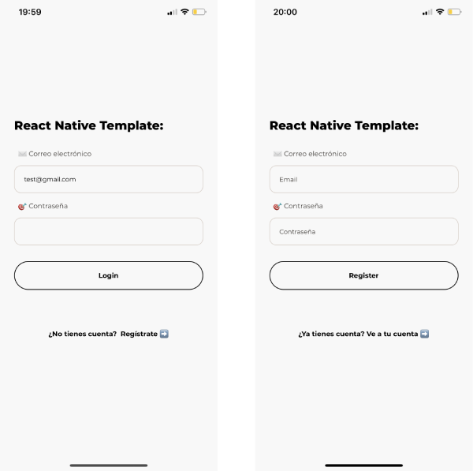

# 📱 React Native Template Project

A React native project initialized with [Expo](https://docs.expo.io/)

## The project has: 

1. Basic project structure with protected routes
2. Navigation with [@react-navigation/native](https://reactnavigation.org/) 
3. Added personalized [@expo-google-fonts](https://docs.expo.io/guides/using-custom-fonts/) 
4. MultiLanguage with [i18n](https://www.npmjs.com/package/i18n)
5. Basic Components like Button, Text and Input
6. Register with [Firebase](https://firebase.google.com/)
7. Project is has created using Hooks

## Contribute

Support by giving a ⭐. 
Any suggestions are welcome!

## My portfolio

[Link to Portfolio](http://www.martamullor.com/)
